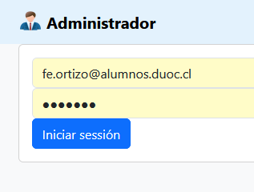

##  Administrador
Proyecto de prueba, conceptos de angular v16.

- Usuario: fe.ortizo@alumnos.duoc.cl
- Contraseña: porponeralgo

#### Funcionalidades
- Sistema de login
- Listar Empleados
- Filtrar Empleados
- Agregar Empleado
- Editar Empleado
- Eliminar Empleado
- Agregar Caracteristica al Empleado

#### Entidades
- Empleado
- Caracteristicas
- Cargo

#### Conceptos puestos en practica: 
- Interpolación
- Directivas 
    - [(ngModel)]
    - [ngClass]
    - [ngStyle] 
    - Event binding
    - *ngFor
    - *ngIf
- Estructura de proyecto componentes, modelos y servicios
    - Clases Modelo
        - Empleado
        - Caracteristicas
    - Comunicacion entre componentes
        - @Input
        - @Output
        - OnInit
    - Services
    - Objetos Interface
- Routes (sistema SPA)
    - QueryParams
    - Guardian
- Integración:
    - Firebase 
        - Base de datos Realtime
        - Authentication
    - Bootstrap 5
    - Angular-font-awesome
    - ng-bootstrap
    - sweetalert2
    - cookies