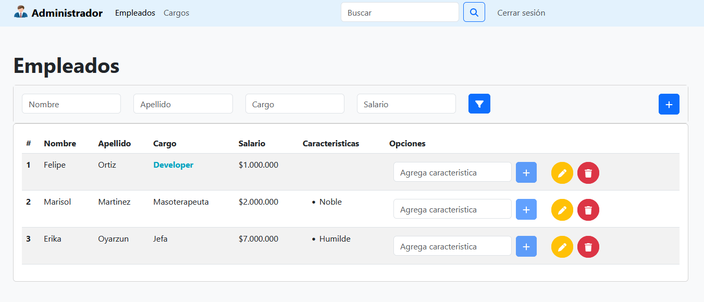

##  Administrador
Proyecto de prueba, conceptos de angular v16.

#### Funcionalidades
- Listar Empleados
- Filtrar Empleados
- Agregar Empleado
- Editar Empleado
- Eliminar Empleado
- Agregar Caracteristica al Empleado

#### Entidades
- Empleado
- Caracteristicas
- Cargo

#### Conceptos puestos en practica: 
- Interpolación
- Directivas 
    - Formulario con [(ngModel)], [ngClass], [ngStyle] y event binding
    - Lista con *ngFor
- Estructura de proyecto componentes, modelos y servicios
    - Clases Modelo
        - Empleado
        - Caracteristicas
    - Comunicacion entre componentes
        - @Input
        - @Output
        - OnInit
    - Services
    - Objetos Interface
- Routes (sistema SPA)
    - QueryParams
- Integración:
    - Firebase Base de datos Realtime
    - Bootstrap 5
    - Angular-font-awesome
    - ng-bootstrap
    - sweetalert2